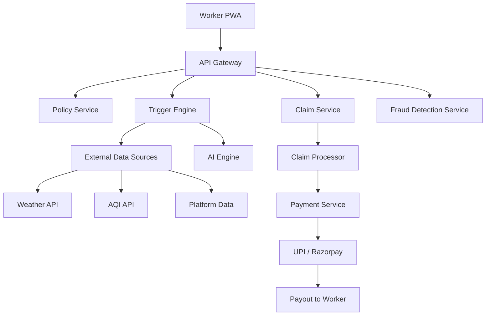

# GigShield — AI-Powered Parametric Income Insurance for Gig Workers

**Guidewire DEVTrails 2026 Hackathon Submission**  
**Persona:** Food Delivery Partners (Zomato / Swiggy)  
**Coverage:** Income loss only · Weekly pricing · Zero-touch claims

---

# 1. Executive Summary

GigShield is a parametric insurance platform designed to protect gig delivery workers from income loss caused by external disruptions such as weather, pollution, curfews, and platform outages.

The system uses real-time data and machine learning to:
- Dynamically price weekly insurance premiums
- Detect disruption events automatically
- Trigger claims without user intervention
- Process payouts instantly via UPI

---

# 2. Problem Statement

India has over 12 million gig delivery workers who rely on daily earnings. When disruptions occur, their income drops to zero for that duration.

## Common Disruptions
- Heavy rain and flooding
- Severe air pollution
- Curfews or strikes
- Platform outages

## Current System Limitations

| Existing Systems | Gap |
|---|---|
| Monthly/annual premiums | Workers need weekly pricing |
| Manual claims (15–45 days) | Workers need instant payouts |
| No gig-specific coverage | Income protection missing |
| Static risk assessment | Real-time risk not considered |

---

# 3. Proposed Solution

GigShield provides **parametric income insurance**, where payouts are triggered automatically when predefined external conditions are met.

## Key Capabilities
- Real-time monitoring of external data sources
- AI-based risk pricing
- Automated claim triggering
- Instant payout processing

---

# 4. Persona

**Food Delivery Partner (Chennai)**
- Works 8–10 hours per day
- Weekly earnings: ₹5,600 – ₹8,400
- Paid weekly
- No financial safety net

---

# 5. Key Innovation

## Platform Outage as an Insurable Event

GigShield introduces coverage for platform-side failures.

**Trigger Condition:**
- Order acceptance drops >70%
- Duration >2 hours
- Not caused by weather

---

# 6. System Flow

1. Worker registers
2. Selects coverage tier
3. Weekly premium is calculated and deducted
4. System monitors external signals
5. Disruption event detected
6. Claim triggered automatically
7. Fraud checks executed
8. Payout processed instantly

---

# 7. Weekly Premium Model

## Formula
Weekly Premium =
Base Rate × Zone Risk × Seasonal Factor × GigScore Adjustment

## Coverage Tiers

| Tier | Weekly Premium | Max Weekly Payout |
|---|---|---|
| Basic | ₹29 | ₹700 |
| Standard | ₹49 | ₹1500 |
| Premium | ₹79 | ₹2500 |

---

# 8. Parametric Triggers

| Trigger | Condition | Max Payout |
|---|---|---|
| Heavy Rain (T1) | >35mm/hr for ≥2 hrs | ₹350 |
| Flood (T2) | Government alert | ₹500 |
| AQI (T3) | AQI > 400 for ≥6 hrs | ₹300 |
| Curfew (T4) | Official restriction ≥3 hrs | ₹450 |
| Platform Outage (T5) | >70% drop ≥2 hrs | ₹250 |

---

# 9. System Architecture

## High-Level Architecture

---

# 10. AI/ML Integration

## Risk Prediction
- Model: Gradient Boosting Regressor
- Purpose: Predict weekly premium

## Fraud Detection
- Model: Isolation Forest
- Detects:
  - GPS inconsistencies
  - Duplicate claims
  - Abnormal claim patterns

---

# 11. Fraud Protection

- GPS vs historical delivery validation
- Event-based claim verification
- Duplicate claim prevention
- Zone-level anomaly detection

---

# 12. Zero-Touch Claims Flow

Event detected  
→ Policy validated  
→ Fraud score calculated  
→ Payout computed  
→ Payment initiated  
→ Worker notified

Total processing time: < 90 seconds

---

# 13. Platform Choice

Web Progressive Web App (PWA)

- No installation required
- Optimized for low-end devices
- Offline capability
- SMS fallback

---

# 14. Core Data Model

- Worker
- Policy
- Claim
- Zone

---

# 15. Tech Stack

## Backend
- FastAPI (Python)
- PostgreSQL
- Redis + Celery

## Frontend
- React (PWA)

## AI/ML
- Scikit-learn

## External APIs
- Weather API
- AQI API
- Platform data (mock)

## Payments
- Razorpay (sandbox)

---

# 16. Development Roadmap

## Phase 1
- Architecture design
- Basic premium model
- README and video

## Phase 2
- Trigger engine
- Claims and payouts
- Working prototype

## Phase 3
- AI models
- Fraud detection
- Dashboards

---

# 17. Competitive Advantages

- Platform outage coverage
- Weekly pricing aligned with gig economy
- Fully automated claims
- AI-driven risk pricing
- Hyperlocal risk scoring

---

# 18. Business Potential

- Average premium: ₹55/week
- Average payout: ₹25/week
- Positive unit economics

## Scaling Strategy
- Insurance partnerships
- Platform integrations

---

# 19. Conclusion

GigShield provides a practical and scalable solution to income instability in the gig economy by combining parametric insurance with real-time data and automation.

It is designed to be deployable, efficient, and aligned with the financial realities of gig workers.