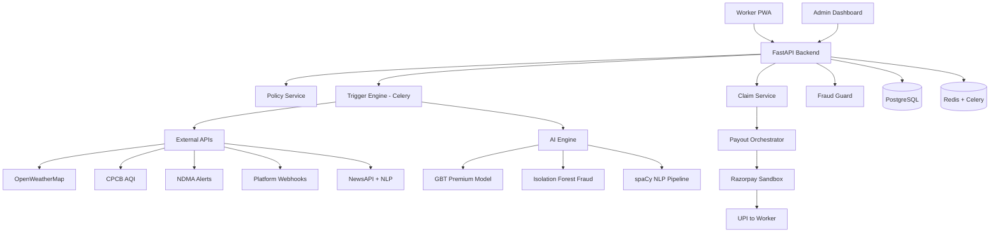
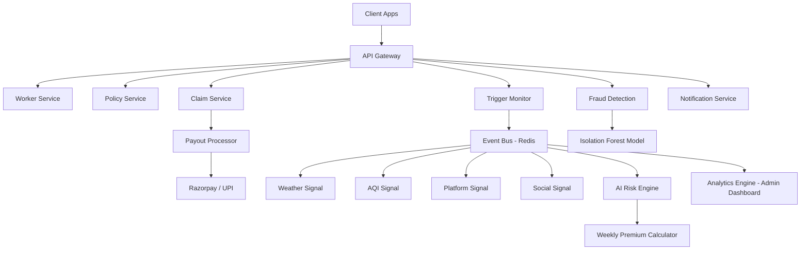

# GigShield — AI-Powered Parametric Income Insurance for India's Gig Economy

**Guidewire DEVTrails 2026 | University Hackathon**  
**Persona:** Food Delivery Partners — Zomato & Swiggy riders, Chennai  
**Coverage:** Income loss only · Weekly pricing · Zero-touch claims · Sub-90s payouts

---

## Table of Contents

1. [Problem Statement](#1-problem-statement)
2. [Why Every Other Solution Fails](#2-why-every-other-solution-fails)
3. [What Makes GigShield Different](#3-what-makes-gigshield-different)
4. [Persona & Real Scenarios](#4-persona--real-scenarios)
5. [Weekly Premium Model](#5-weekly-premium-model)
6. [Parametric Triggers](#6-parametric-triggers)
7. [System Architecture](#7-system-architecture)
8. [AI/ML Integration](#8-aiml-integration)
9. [Fraud Detection Engine](#9-fraud-detection-engine)
10. [Zero-Touch Claims Flow](#10-zero-touch-claims-flow)
11. [Tech Stack](#11-tech-stack)
12. [Platform Choice — Web PWA](#12-platform-choice--web-pwa)
13. [Development Roadmap](#13-development-roadmap)
14. [Business Viability](#14-business-viability)

---

## 1. Problem Statement

India has **12+ million gig delivery workers** on Zomato, Swiggy, Zepto, and Amazon. When a monsoon floods their zone, a curfew shuts their area, or a severe AQI alert grounds them — they earn **₹0 for that day**. No safety net. No recourse.

External disruptions cost the average gig worker **20–30% of monthly income**. Currently, they handle this by borrowing from moneylenders at 2–5%/month, skipping meals, or riding through dangerous conditions.

**No insurance product in India covers this.** Existing products require annual premiums, 15–45 day manual claims, and formal employment proof — all three of which structurally exclude gig workers.

---

## 2. Why Every Other Solution Fails

The current "system" is three actors who **never communicate** during a disruption:

```
┌──────────────────────┐     ┌──────────────────────┐     ┌──────────────────────┐
│   GIG PLATFORM       │     │  FORMAL INSURANCE    │     │   THE WORKER         │
│  (Zomato/Swiggy)     │     │  (IRDAI products)    │     │  (Self-managed)      │
├──────────────────────┤     ├──────────────────────┤     ├──────────────────────┤
│ Has earnings data    │     │ Annual/monthly only  │     │ Chit funds           │
│ Has GPS data         │ ✗   │ 15–45 day claims     │ ✗   │ Moneylenders         │
│ Has zone data        │     │ Excludes gig workers │     │ Works through danger │
│ Zero disruption cover│     │ Static risk forms    │     │ Absorbs full loss    │
└──────────────────────┘     └──────────────────────┘     └──────────────────────┘
```

**The gap:** The platform has the data. The insurer has the infrastructure. Neither connects them. GigShield sits at that intersection.

| What Exists Today | What Gig Workers Actually Need |
|---|---|
| Annual / monthly premiums | Weekly premiums (matches pay cycle) |
| Static risk forms at signup | Real-time hyper-local risk data |
| Manual 15–45 day claims | Automatic sub-90-second payouts |
| City-level aggregate risk | Pincode-cluster-level risk scoring |
| Health / accident coverage only | Income protection during disruptions |

---

## 3. What Makes GigShield Different

All teams have the same problem statement. Here is what separates GigShield:

### 3.1 Platform Outage as an Insurable Event (Industry First)
No parametric insurance product anywhere in the world covers app-side platform failures. When Swiggy's order routing fails during peak dinner hours, every rider in that zone loses income — and no existing product touches it. GigShield monitors zone-wide order acceptance rates using anomaly detection and triggers payouts for verified outages. This is a **new category** of parametric insurance.

### 3.2 Zone-Learning Feedback Loop
Most risk models are trained once. Ours retrains **every Sunday night** on the prior 12 weeks of zone × event × claim data. Zones where workers rarely claim despite disruptions get recalibrated. Zones with rising claim rates get flagged. The model gets smarter weekly — not just about weather, but about how disruptions affect *this pincode's workers specifically*.

### 3.3 GigScore — The Worker's Resilience Score
A 0–100 score inspired by credit scores but built for the gig economy. It rewards continuous coverage, responsible claiming, and platform activity consistency. A high GigScore earns up to **30% premium discount** and fast-track payouts. This creates a loyalty loop that no traditional insurer offers gig workers — and directly reduces churn.

### 3.4 Hyper-Local Pincode Risk Scoring
Traditional insurers use city-level aggregates. We score at **pincode cluster level** (5–6 pincodes grouped by geography and delivery zone similarity). Velachery (flood-prone, low-lying) and Perungudi (elevated, well-drained) carry different risk scores even though they're in the same city. Workers in safer zones pay less — accurately.

### 3.5 Dual Dashboard — Worker + Insurer
We build both sides. The worker sees their GigScore, active coverage, and claim history. The insurer/admin sees live loss ratios, next-week disruption forecasts, fraud alert queues, and premium adequacy analysis by zone. This makes GigShield pitch-able to actual insurers as a **B2B2C platform**, not just a consumer app.

---

## 4. Persona & Real Scenarios

**Profile:** Rajan, Swiggy delivery partner, Velachery, Chennai  
Works 9 hours/day · Earns ₹7,000/week · Pays weekly through platform settlement · Zero savings buffer

### Scenario A — Heavy Rain (Trigger T1)
Rajan wakes to 58mm/hr rain forecast. By 11am his zone goes silent — flooded roads, no orders. Old system: he loses ₹700 and borrows from his cousin. **GigShield:** weather trigger fires at 11:20am, fraud guard clears him in 8 seconds, ₹350 lands in his UPI by 11:22am.

### Scenario B — Platform Outage (Trigger T5 — our unique trigger)
Swiggy's order routing fails 6–9pm (peak dinner hours). Order acceptance drops 74% across South Chennai. This is not weather, not a curfew — **no existing insurance covers this**. GigShield's zone-wide anomaly detector confirms the drop, isolates it from weather events, and processes ₹250 to every active policyholder in the affected zone automatically.

### Scenario C — Curfew / Section 144 (Trigger T4)
Priya, a Zomato partner in T. Nagar, is mid-shift when authorities issue movement restrictions. GigShield's NLP pipeline detects the gazette notification within 12 minutes, cross-references her active zone, and processes ₹450 to her account — before she even realises what triggered it.

---

## 5. Weekly Premium Model

### Why Weekly
Gig workers earn weekly and spend daily. Annual or monthly premiums require upfront cash they don't have. By aligning premium deduction to the platform's existing weekly settlement, coverage becomes **frictionless** — the ₹49–65 is deducted before the payout reaches the worker, never from their pocket separately.

### Formula

```
Weekly Premium = Base Rate (₹49) × Zone Risk Factor × Seasonal Multiplier × GigScore Discount

Zone Risk Factor   : 0.80 – 1.40  (pincode cluster disruption history)
Seasonal Multiplier: 1.00 – 1.30  (monsoon Jun–Sep gets 1.20–1.30×)
GigScore Discount  : 0.70 – 1.00  (high GigScore = up to 30% off)
```

### Coverage Tiers

| Tier | Weekly Premium | Max Weekly Payout | Target Worker |
|---|---|---|---|
| Basic | ₹29 | ₹700 | Part-time, <5 hrs/day |
| Standard | ₹49 | ₹1,500 | Full-time, 8 hrs/day |
| Premium | ₹79 | ₹2,500 | High-earner, 10+ hrs/day |

### Premium Examples (Chennai)

| Zone | Risk Level | Season | GigScore | Weekly Premium |
|---|---|---|---|---|
| Velachery (600042) | High flood | Monsoon | 60 | ₹71 |
| Perungudi (600096) | Low flood | Monsoon | 60 | ₹52 |
| T. Nagar (600017) | Medium curfew | Dry | 85 | ₹39 |

### Deduction Flow
Premium is deducted automatically from the weekly platform settlement every Monday morning — before the payout reaches the worker's bank account. New policy activates immediately. Worker is notified via app + SMS.

---

## 6. Parametric Triggers

GigShield monitors 5 independent external signals. Any single trigger, verified and fraud-cleared, initiates an automatic payout.

| ID | Trigger | Threshold Condition | Data Source | Max Payout |
|---|---|---|---|---|
| T1 | Heavy Rain | >35mm/hr for ≥2 continuous hours in worker's active zone | OpenWeatherMap + IMD (mock) | ₹350/day |
| T2 | Urban Flood | NDMA Flood Level 2+ alert for worker's pincode cluster ≥4 hrs | NDMA API (mock) | ₹500/day |
| T3 | Severe AQI | AQI >400 sustained ≥6 hours in city boundary | CPCB AQI feed | ₹300/day |
| T4 | Curfew / Strike | Delivery restriction confirmed in worker's zone ≥3 hrs | Govt gazette + News NLP | ₹450/day |
| T5 ★ | Platform Outage | Zone-wide order acceptance drops >70% vs 4-week avg for ≥2 hrs (weather-absent) | Platform webhook + Isolation Forest | ₹250/day |

★ T5 is a **GigShield-exclusive trigger** — no other insurance product covers this event type.

### Payout Calculation
```
Daily Payout = min(Trigger Max, Worker's Avg Hourly Rate × Hours Disrupted)
Avg Hourly Rate = 4-week rolling avg weekly income ÷ avg active hours/week

Example: Worker earns ₹6,000/week over 50 hrs → ₹120/hr
T1 fires for 3 hours → 3 × ₹120 = ₹360 → capped at T1 max → ₹350 paid
```

Multiple triggers can fire in a day but total payout never exceeds actual average daily earnings.

---

## 7. System Architecture

### High-Level Flow



### Microservices Breakdown



---

## 8. AI/ML Integration

### 8.1 Weekly Premium Risk Model

**Algorithm:** Gradient Boosted Regressor (`sklearn.ensemble.GradientBoostingRegressor`)  
**Retraining:** Every Sunday 11pm — before Monday morning policy renewals  
**Target accuracy:** MAE < ₹8 on premium prediction (cross-validated on held-out zones)

**Input features:**

| Feature | Type | Description |
|---|---|---|
| `zone_pincode_cluster` | int (encoded) | Worker's operating zone |
| `avg_weekly_active_hours` | float | Rolling 4-week average |
| `zone_flood_risk_score` | float (0–1) | Historical disruption frequency |
| `is_monsoon_season` | bool | Jun–Sep flag |
| `week_forecast_rain_mm` | float | Next 7-day IMD forecast |
| `week_forecast_aqi_avg` | float | Predicted AQI for week |
| `gigascore` | float (0–100) | Worker resilience score |
| `claim_count_12w` | int | Claims in last 12 weeks |
| `claim_to_disruption_ratio` | float | Personal fraud signal |
| `zone_avg_disruption_days_12w` | float | Zone-level disruption baseline |

**Output:** `predicted_weekly_premium` (₹)

### 8.2 GigScore — Resilience Scoring

GigScore (0–100) is computed weekly per worker. It is not just a discount mechanism — it is the loyalty and trust layer of the platform.

| Component | Weight | Effect |
|---|---|---|
| Weeks continuously covered | 25% | Continuity bonus |
| Claim-to-disruption ratio | 30% | High ratio = fraud signal |
| Zone risk vs. premium paid | 20% | Fair pricing alignment |
| Platform activity consistency | 25% | Active workers rewarded |

Score ≥ 80 → 30% premium discount + fast-track payout  
Score 60–79 → 15% discount  
Score < 60 → Standard rate

### 8.3 Zone-Learning Feedback Loop

Every Sunday, the model retrains on the prior 12 weeks of `zone × trigger_type × claim_outcome` data. Zones where claim rates diverge significantly from predicted disruption frequency are automatically flagged for threshold review. This means the model improves its zone-level pricing precision each week without manual intervention.

### 8.4 News NLP Pipeline (Trigger T4)

spaCy NER pipeline processes government gazette notifications and news headlines to detect curfew/restriction events:

```
Raw text → NER (Location, Event Type, Duration) → Classifier
→ Categories: [CURFEW, STRIKE, BANDH, SECTION_144, IRRELEVANT]
→ Location matcher (does it overlap with any active worker zone?)
→ Confidence > 0.85 → T4 evaluation triggered
```

---

## 9. Fraud Detection Engine

### Attack Vectors & Countermeasures

| Attack | How It Works | GigShield Counter |
|---|---|---|
| GPS Spoofing | Fakes location inside disrupted zone | Cross-check GPS vs last 6 platform delivery locations; flag >2km gap |
| Policy Front-Running | Buys policy after storm warning issued | 6-hour lockout between policy activation and first eligible claim |
| Claim Duplication | Same event filed multiple times | Event ID deduplication + device fingerprint + Aadhaar hash match |
| Coordinated Fraud | Group files simultaneously without real inactivity | Zone-level claim rate vs platform order activity correlation |
| Threshold Gaming | Moves to high-risk zone temporarily | Zone assigned from 4-week GPS centroid, not real-time location |
| Fake Platform Outage | Individual goes offline, claims T5 | T5 requires zone-wide signal — individual inactivity alone never qualifies |

### Isolation Forest Scoring

**Algorithm:** `sklearn.ensemble.IsolationForest` (contamination=0.05, n_estimators=200)

Input features per claim: GPS deviation from zone centroid, hours since policy activation, claim frequency in 12 weeks, zone claim rate vs baseline, platform activity drop %, time since last delivery, device seen before, trigger matches zone history.

| Score Range | Decision | Action |
|---|---|---|
| 0.75 – 1.00 | AUTO APPROVE | Payout processed immediately |
| 0.50 – 0.74 | SOFT REVIEW | Queued for admin review (24hr window) |
| 0.00 – 0.49 | BLOCK + FLAG | Payment blocked, anomaly logged |

---

## 10. Zero-Touch Claims Flow

```
[Disruption detected by trigger monitor]
        ↓ < 5 min
[Threshold verified — event ID generated]
        ↓ < 10 sec
[Active policy confirmed + 6hr lockout cleared]
        ↓ < 15 sec
[Fraud Guard: Isolation Forest score computed]
        ↓
   Score ≥ 0.75?
   YES ↓              NO → BLOCK + FLAG
[Payout = min(trigger_max, hours × avg_hourly_rate)]
        ↓ < 60 sec
[Razorpay UPI transfer initiated]
        ↓ < 90 sec total
[Worker notified: SMS + FCM push]
"₹350 credited. Claim #GS-2026-0441"
        ↓
[Event logged → Admin dashboard updated via WebSocket]
```

---

## 11. Tech Stack

### Backend
| Layer | Technology | Reason |
|---|---|---|
| Language | Python 3.12 | AI/ML ecosystem, team expertise |
| Framework | FastAPI | Async, auto OpenAPI docs, high performance |
| Task Queue | Celery 5 + Redis | Async trigger monitoring, weekly retrain jobs |
| ORM | SQLAlchemy 2.0 | Type-safe async models |
| Database | PostgreSQL 16 | ACID compliance, JSON event payloads |
| Validation | Pydantic v2 | FastAPI-native strict validation |

### AI / ML
| Component | Technology | Reason |
|---|---|---|
| Premium Model | scikit-learn GBT | Interpretable, fast inference, weekly retraining |
| Fraud Detection | Isolation Forest | Unsupervised — no labelled fraud data needed at start |
| News NLP (T4) | spaCy 3 + custom NER | Lightweight, good Hindi/Tamil entity support |
| Data Processing | pandas + NumPy | Standard feature engineering pipeline |
| Model Tracking | MLflow (local) | Compare retraining runs across weeks |

### Frontend
| Layer | Technology | Reason |
|---|---|---|
| Framework | React 18 + TypeScript | Shared codebase for worker app + admin dashboard |
| PWA | Vite + Workbox | Offline support, no app store needed |
| Charts | Chart.js | Loss ratios, disruption forecasts (admin) |
| UI | Tailwind CSS + shadcn/ui | Mobile-first, accessible |
| Real-time | WebSocket (native) | Live admin dashboard updates |
| Notifications | Firebase Cloud Messaging | Push to worker PWA |

### External APIs
| API | Trigger | Access |
|---|---|---|
| OpenWeatherMap | T1 Rain | Free tier (1,000 calls/day) |
| CPCB AQI | T3 AQI | Public / mock |
| NDMA Flood | T2 Flood | Mock + scraper |
| NewsAPI | T4 Curfew | Free tier + spaCy NLP |
| Razorpay | Payouts | Test/sandbox mode |
| Firebase | Notifications | Spark plan (free) |

### Infrastructure
- **Docker + Docker Compose** — single command local setup
- **Railway / Render** — free-tier deployment (supports PostgreSQL + Redis)
- **Nginx** — reverse proxy for static + API

---

## 12. Platform Choice — Web PWA

We chose PWA over native mobile for three concrete reasons:

1. **No install barrier** — workers already manage 1–2 platform apps. A PWA is a browser link, installable in one tap, works offline.
2. **Device performance** — delivery workers use ₹6,000–₹15,000 Android phones. A Vite-bundled PWA outperforms React Native on constrained RAM.
3. **SMS fallback** — all critical events (policy activated, claim triggered, payout sent) are duplicated via SMS for low-connectivity situations.

---

## 13. Development Roadmap

### Phase 1 — Ideation & Foundation (Weeks 1–2) | Due: March 20

- [x] README published to GitHub (this document)
- [ ] Docker Compose setup: FastAPI + PostgreSQL + Redis
- [ ] Worker registration API + platform OAuth mock
- [ ] Chennai zone cluster data seeded (12 clusters)
- [ ] Rule-based premium calculator (pre-ML baseline)
- [ ] Figma wireframes: worker onboarding + policy view
- [ ] 2-minute video: strategy walkthrough + wireframe demo

### Phase 2 — Automation & Protection (Weeks 3–4) | Due: April 4

- [ ] GBT premium model trained on synthetic Chennai data
- [ ] Celery Beat trigger monitor: all 5 triggers live (T1, T3 with real APIs; T2, T4, T5 mocked)
- [ ] Isolation Forest fraud guard v1
- [ ] Full claims API: creation → fraud check → payout decision
- [ ] Razorpay sandbox: end-to-end payout simulation
- [ ] Worker PWA: onboarding, policy view, claim status screens
- [ ] Admin dashboard: loss ratio chart + live event log
- [ ] 2-minute demo video: trigger → auto-claim → UPI payout

### Phase 3 — Scale & Optimise (Weeks 5–6) | Due: April 17

- [ ] Fraud v2: GPS spoofing detection + coordinated fraud check
- [ ] GigScore algorithm + worker-facing score widget
- [ ] Zone-learning weekly retraining pipeline (MLflow tracking)
- [ ] spaCy NLP pipeline for T4 curfew detection
- [ ] Worker dashboard: earnings protected widget + coverage timeline
- [ ] Admin dashboard: disruption forecast + fraud queue + zone risk heatmap
- [ ] Demo simulation: fake rainstorm → auto-claim → UPI payout (screen recorded)
- [ ] 5-minute final demo video
- [ ] Final pitch deck PDF

---

## 14. Business Viability

### Unit Economics (Standard Tier, Chennai, per worker per week)

| Item | Amount |
|---|---|
| Average weekly premium collected | ₹55 |
| Expected claim payout | ₹25 |
| Gross margin | ₹30 |
| API + compute cost | ~₹2 |
| Payment processing (Razorpay) | ~₹1.50 |
| **Net contribution per worker/week** | **~₹26.50** |

At 10,000 active workers → **~₹1.3 Crore net/year**

### Why the Economics Work
The claim expectation of ₹25/week assumes ~0.8 disruption days per worker per week on average in Chennai during mixed seasons. During peak monsoon this rises — but so does the seasonal multiplier on premiums, which self-adjusts the margin.

### Distribution Model
GigShield operates as **B2B2C**: a licensed insurer (Digit, Bajaj Allianz, or New India) provides the IRDAI regulatory wrapper. GigShield provides the technology layer — risk scoring, trigger monitoring, fraud detection, payouts. Revenue split via technology service fee. Alternatively, direct platform integration (Zomato/Swiggy deducts premium from settlement) eliminates distribution cost entirely.

### Regulatory Fit
Structured as **index-based parametric coverage** under IRDAI's Regulatory Sandbox (2019). Explicitly excludes health, life, accident, and vehicle repair — remaining within the parametric income protection category. No regulatory approval required for hackathon demo scope.

---

*GigShield — Protect the people who deliver India's digital economy.*

**Repository:** https://github.com/[team]/gigshield  
**Demo Video (Phase 1):** [To be added by March 20]